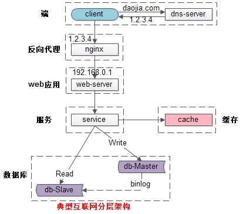

# gin-web

[官方文档](https://github.com/gin-gonic/gin)

[参考文档](https://github.com/skyhee/gin-doc-cn#install)

@[TOC]
- [安装](#安装)
- [基本使用](#[基本使用](doc/base%20use.md))
- [基于DDD设计](#基于DDD设计)
- [Docker部署](#[Docker部署](doc/docker%20use.md))
- [架构](#架构)
- [推荐](#推荐)

## 安装
```bash
go get -u github.com/gin-gonic/gin
```

## [基本使用](doc/base%20use.md)

## 基于DDD设计

[领域驱动设计: 软件核心复杂性应对之道.pdf](doc/领域驱动设计：软件核心复杂性应对之道.pdf)

[DDD设计思想](doc/DDD.md)


## [Docker部署](doc/docker%20use.md)

## 架构



## 推荐

- [设计数据密集型应用](https://github.com/Vonng/ddia)
- [通用设计与方法论](https://www.w3cschool.cn/architectroad/architectroad-optimization-of-seckilling-system.html)
